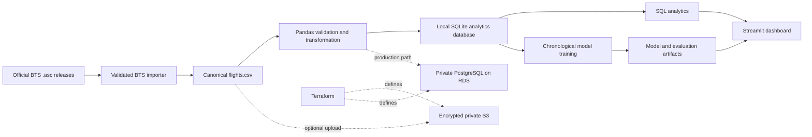
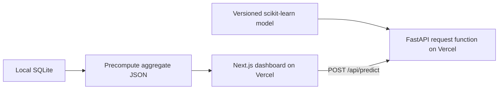
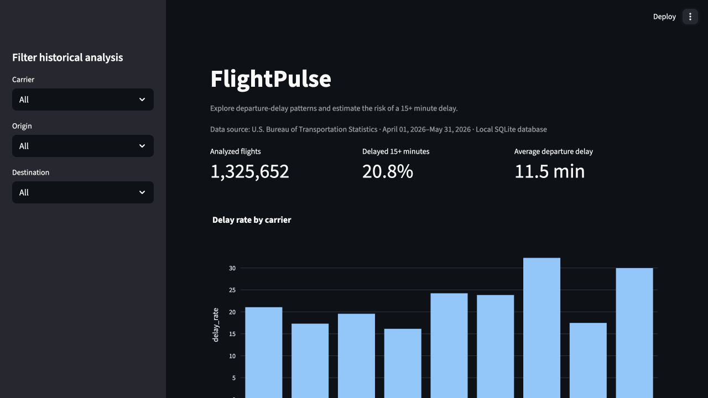
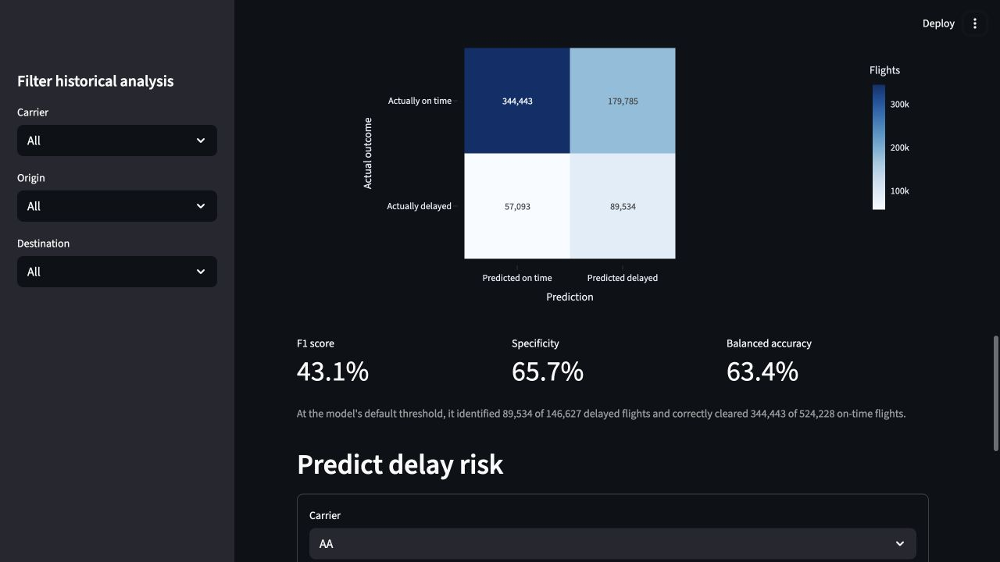

# FlightPulse

FlightPulse is an end-to-end data science project that analyzes U.S. airline delays and predicts whether a departure will be delayed by at least 15 minutes. It combines a Python data pipeline, SQL analytics, a scikit-learn model, a Streamlit dashboard, and secure AWS infrastructure defined with Terraform.

**[Launch the original Streamlit dashboard](https://flight-delay-platform-9wvanzjxnud3fg3zubxvgh.streamlit.app/)**

**[Launch the production-style Next.js dashboard](https://flightpulse-delay.vercel.app/)**

A production-style Next.js replacement is now maintained in [`web/`](web). It preserves the
historical exploration, prediction, and model-evaluation experience while removing the need for
a continuously running Streamlit session. The original app remains available until the new
deployment is fully verified.

## What it demonstrates

- Imports real Bureau of Transportation Statistics (BTS) on-time flight records
- Validates and cleans data with pandas, then loads an analytics database
- Answers carrier, route, and departure-time questions with SQL
- Trains a random-forest classification model and reports reproducible metrics
- Presents results and interactive predictions in a Streamlit dashboard
- Designs private, encrypted S3 and PostgreSQL infrastructure on AWS
- Runs tests, linting, dependency auditing, and static security checks in CI

## Architecture



The default development workflow is entirely local and inexpensive: raw releases become a
canonical CSV, the pipeline loads SQLite, and the dashboard reads the database and trained-model
artifacts. Terraform documents the later production path without requiring cloud resources for
local reproduction.

### Vercel web architecture



The browser downloads a compact read-only aggregate instead of the 160 MB SQLite database. The
Python function loads only the 13 MB trained model and runs when a prediction is requested. This
initial deployment targets Vercel Hobby at $0/month and uses its included `vercel.app` address;
no custom domain or paid backend is required.

## Dashboard

### Historical analytics



### Model evaluation



## Local workflow

```bash
python3 -m venv .venv
.venv/bin/pip install -r requirements-dev.txt
make demo
make load
make train
make dashboard
```

The generated demo data exists only to exercise the pipeline. Portfolio results should use the official BTS file and clearly identify its source and coverage.

The prediction model intentionally excludes actual departure delay, weather-delay attribution,
and air time because those values are not known when a pre-departure prediction is made. This
prevents target leakage and keeps the evaluation honest.

## Deployment

The [public dashboard](https://flight-delay-platform-9wvanzjxnud3fg3zubxvgh.streamlit.app/) is
deployed from GitHub with Streamlit Community Cloud. Because generated
databases and models do not belong in Git, a fresh hosted instance downloads a versioned 35 MB
GitHub Release bundle, verifies its pinned SHA-256 checksum, and restores only the SQLite database,
trained model, and evaluation metrics. No credentials or raw BTS releases are included. See the
[deployment guide](docs/DEPLOYMENT.md) for the complete flow and rebuild instructions.

For the new interface, set the Vercel project's root directory to `web`. Vercel builds the Next.js
frontend and discovers the FastAPI function in `web/api/index.py`. The Python dependency versions
are pinned to the versions that created the serialized model. See
[`docs/VERCEL_MIGRATION.md`](docs/VERCEL_MIGRATION.md) for the migration inventory and cost boundary.

To run the replacement locally:

```bash
.venv/bin/python -m scripts.export_web_analytics
cd web
npm install
npm run dev
```

## Real BTS release

Convert a downloaded pipe-delimited BTS `.asc` release:

```bash
.venv/bin/python -m src.import_bts_asc /path/to/ontime.td.202605.asc \
  --output data/raw/flights.csv
make load
make train
```

Pass several releases before `--output` to build a combined chronological dataset:

```bash
.venv/bin/python -m src.import_bts_asc \
  /path/to/ontime.td.202604.asc \
  /path/to/ontime.td.202605.asc \
  /path/to/ontime.td.202606.asc \
  --output data/raw/flights.csv
```

The combined importer sorts records by date and removes exact duplicate records.

## Reproduced April–May 2026 results

The current evaluation uses the official April and May 2026 releases from the
[BTS Airline Service Quality Performance 234 archive](https://www.bts.gov/browse-statistical-products-and-data/bts-publications/airline-service-quality-performance-234-time).

- Source rows validated and loaded: **1,337,905**
- Cancelled flights excluded from model training: **12,253**
- Non-cancelled flights available for training/evaluation: **1,325,652**
- Non-cancelled flights delayed at least 15 minutes: **276,089 (20.83%)**
- Out-of-month ROC-AUC: **0.688**
- Logistic-regression baseline ROC-AUC: **0.681**
- Out-of-month accuracy: **64.69%**
- Out-of-month precision: **33.24%**
- Out-of-month recall: **61.06%**

The generated metrics artifact and dashboard also report the May holdout confusion matrix, F1,
specificity, and balanced accuracy so the model's false-alarm versus missed-delay tradeoff remains
visible despite the imbalanced target.

The model trains on all non-cancelled April flights and tests on every non-cancelled May flight, so
the test month never enters training. These two-month results remain a baseline and should not be
interpreted as proof of seasonal performance. Random forest is retained because it slightly
outperforms logistic regression on the identical May holdout. See
[`docs/METHODOLOGY.md`](docs/METHODOLOGY.md) for definitions and limitations.

Run `make check` before every push. Never commit `.env`, credentials, databases, raw datasets, or trained model artifacts.
