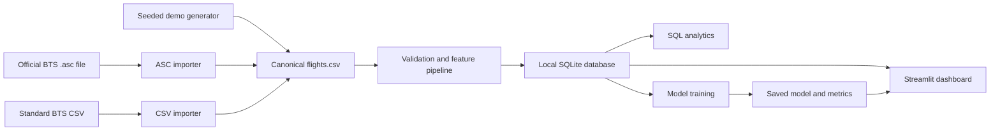
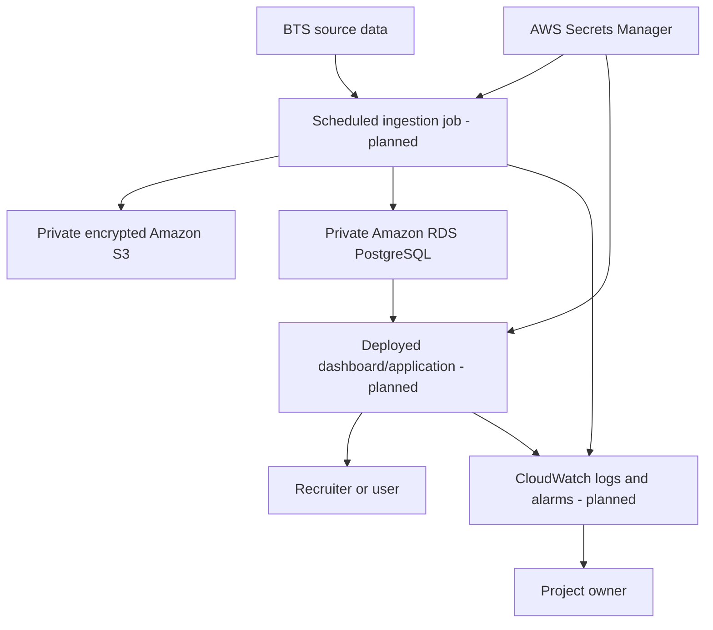

# FlightPulse: complete project guide

This document explains what FlightPulse is, why it exists, how every part works, which design
choices were made, what is currently real, and what remains planned. It is intended to be studied,
not memorized word for word.

## 1. The thirty-second explanation

FlightPulse is an end-to-end data science application for analyzing U.S. flight delays and
estimating whether a scheduled flight will depart at least 15 minutes late. It imports official
Bureau of Transportation Statistics (BTS) records, validates and cleans them with Python and
pandas, stores them in a SQL database, trains a scikit-learn classification model, and displays
analytics and predictions in a Streamlit dashboard. The local version uses SQLite; the repository
also contains a secure AWS design using private Amazon RDS PostgreSQL and encrypted Amazon S3.

The current model is a baseline trained on April 2026 and tested on May 2026. It achieves an
out-of-month ROC-AUC of 0.688.
It intentionally uses only fields available before departure to avoid target leakage.

## 2. What problem are we solving?

There are two related problems:

1. **Descriptive analytics:** What delay patterns exist by carrier, route, and scheduled departure
   hour?
2. **Predictive analytics:** Given information known before departure, how likely is a flight to
   depart at least 15 minutes late?

The project is useful as a portfolio project because it combines data ingestion, validation,
feature engineering, SQL, machine learning, application development, testing, security, and cloud
architecture. It is more than a notebook: the same data moves through a repeatable system.

It supplements the AWS and pipeline work described in the NextGen internship, but it does not
prove or recreate the internship. On a resume and in interviews, it must be presented as an
independent project.

## 3. What is implemented versus planned?

### Implemented and verified

- A real May 2026 BTS `.asc` file was validated and imported.
- All 1,337,905 April–May source records were loaded into a local SQLite analytics database.
- The 12,253 cancelled flights were excluded from model training.
- A random-forest model was trained on 654,797 April flights and tested on 670,855 May flights.
- SQL queries compute carrier, route, hourly, and overall delay statistics.
- A local Streamlit dashboard reads the database and model.
- Unit tests cover the importers, transformation pipeline, and model.
- Ruff, Bandit, pip-audit, Dependabot, and GitHub Actions provide quality/security gates.
- Terraform describes private, encrypted S3 and RDS resources.

### Designed but not yet completed

- The Terraform resources have not been provisioned in an AWS account.
- S3 is not yet the routine source of data for a deployed pipeline.
- The dashboard is not publicly deployed.
- Data does not download or update automatically.
- The model has not been evaluated across several months or with a time-based split.
- There is not yet an application/API service inside the AWS VPC that is authorized to reach RDS.
- Monitoring, scheduled jobs, authentication, and production logging are not yet implemented.

This distinction matters. It is accurate to say, “I designed the AWS infrastructure in Terraform.”
It is not yet accurate to say, “I deployed the production application on AWS.”

## 4. Real data and current results

The source used in the current run is `ontime.td.202605.asc`, an official BTS May 2026
pipe-delimited release.

| Measurement | Result |
| --- | ---: |
| Source/database records | 1,337,905 |
| Cancelled records | 12,253 |
| Non-cancelled model records | 1,325,652 |
| Non-cancelled flights delayed at least 15 minutes | 276,089 |
| Non-cancelled delayed share | 20.83% |
| Average non-cancelled departure delay | 11.53 minutes |
| Out-of-month accuracy | 64.69% |
| Out-of-month precision | 33.24% |
| Out-of-month recall | 61.06% |
| Out-of-month ROC-AUC | 0.688 |

The raw file, generated database, and trained model are not committed to GitHub. They are large or
generated artifacts and can be reproduced from the source file and versioned code.

## 5. Architecture today

### Why use a canonical CSV between the importer and pipeline?

BTS publishes more than one layout. The CSV and `.asc` importers translate those source-specific
layouts into one small, predictable schema. Everything downstream can then operate without knowing
which source format was downloaded. This is separation of concerns: importers understand external
formats; the pipeline understands the internal format.

### Why SQLite locally?

SQLite requires no server, credentials, or monthly bill. It is appropriate for learning, automated
tests, and a dataset of this size on one computer. It also uses real SQL, so queries and many data
access patterns transfer to PostgreSQL.

SQLite is not the final scaling choice. It permits limited concurrent writes, is stored in one local
file, and is not designed as a shared managed cloud database. PostgreSQL is the planned deployed
database.

## 6. Detailed data flow

### Step 1: acquire the source

The BTS sources are downloaded manually today. April and May contain 1,337,905 total rows with 71
pipe-separated fields per record. The original sources are retained outside Git.

### Step 2: import the source format

`src/import_bts_asc.py` verifies that the file has an `.asc` extension, is smaller than the 1 GB
safety limit, and has exactly 71 fields in each of the first 1,000 rows. It reads only explicitly
selected field positions rather than trusting or retaining all fields.

The selected data is normalized to names such as `flight_date`, `carrier`, `origin`,
`destination`, `scheduled_departure_hour`, and `departure_delay_minutes`.

There is also a separate `src/import_bts.py` importer for the more common header-based BTS CSV
format. It supports both newer and legacy column names through an alias map.

### Step 3: transform and validate

`src/pipeline.py` checks that every required internal column exists. It then:

- parses dates;
- normalizes airport and carrier codes to uppercase;
- converts numeric fields safely;
- removes rows missing essential values;
- removes exact duplicate rows;
- constrains cancellation to 0 or 1;
- derives month and weekday from the date; and
- creates `is_delayed`, where 1 means a departure delay of at least 15 minutes.

The 15-minute threshold is the classification target used throughout the project. Early arrivals
and departures have negative delay values; this is valid data and is retained.

### Step 4: load the SQL database

The transformed dataframe replaces the `flights` SQL table. Indexes are created on flight date,
route, and carrier because those fields are repeatedly used to filter or group analytics.

Replacing the table makes local runs simple and reproducible. A production system would normally
use incremental loads, idempotent record keys, transactions, and migration tooling rather than
replacing the entire table.

### Step 5: train the model

Cancelled records are excluded because they do not have a meaningful observed departure-delay
outcome. The target is `is_delayed`.

The current features are:

- carrier;
- origin airport;
- destination airport;
- scheduled departure hour;
- month; and
- weekday.

Carrier and airport codes are categorical, so `OneHotEncoder` converts them to numeric indicator
columns. Unknown categories are ignored so a new carrier or airport does not crash prediction.

The classifier is a random forest with 180 trees, maximum depth 12, minimum leaf size 4, balanced
class weights, and a fixed random seed. The depth and leaf constraints reduce overfitting. Balanced
class weights matter because only about 21.9% of flights are delayed, so the classes are uneven.

The model and preprocessing are wrapped in one scikit-learn `Pipeline`. This ensures training and
prediction apply exactly the same categorical encoding.

### Step 6: evaluate

The current evaluation is out-of-month. All eligible April flights train the model, and all eligible
May flights form the untouched test set. This represents learning from an earlier month to rank
later flights and ensures no May record appears in training. A fixed model seed keeps training
reproducible.

- **Accuracy** answers: what share of all classifications was correct?
- **Precision** answers: among flights predicted to be delayed, what share really was delayed?
- **Recall** answers: among flights that were delayed, what share did the model detect?
- **ROC-AUC** measures how well the probability score ranks delayed flights above non-delayed
  flights across thresholds.

Accuracy alone is misleading for an imbalanced target. A model predicting “not delayed” every time
would already be correct about 78% of the time. The balanced random forest trades some accuracy for
much stronger detection of actual delays, which is why recall and ROC-AUC are essential context.

### Step 7: display results

The Streamlit app loads non-cancelled flights from SQL, caches them, calculates summary metrics,
draws Plotly carrier/hour charts, lists high-delay routes, and loads the saved model for interactive
probability estimates.

Streamlit was chosen because it lets a data scientist create an interactive Python application
without first building a separate JavaScript frontend and REST API. That makes it suitable for the
portfolio stage. A larger production product might separate a React frontend, API, and model
service.

## 7. Preventing target leakage

Target leakage occurs when training features reveal information that would not exist at the moment
a prediction is requested. It creates impressive but dishonest test scores.

FlightPulse does **not** train on:

- actual departure delay, because that directly defines the target;
- cancellation status, because the model is for flights expected to depart;
- actual air time, because it is known only after the flight; or
- attributed weather-delay minutes, because those are reported after a delay occurs.

Air time and weather attribution can still be stored for historical analysis. Storage does not mean
the model must use a field.

## 8. Planned AWS architecture

### Why S3?

S3 is durable object storage suited to raw and processed datasets. It separates durable source data
from the compute process and provides encryption, versioning, and lifecycle controls. Public access
is blocked in Terraform.

### Why RDS PostgreSQL?

RDS provides a managed relational database with PostgreSQL SQL semantics, backups, encryption, and
network controls. PostgreSQL is a natural step up from SQLite when the application is shared and
multiple processes need database access.

### Why Terraform?

Terraform expresses infrastructure as reviewed, versioned code. It reduces undocumented console
clicks and makes the design reproducible. A Terraform plan must still be reviewed before applying
because it can create billable resources.

### Why a VPC and private database?

RDS is marked `publicly_accessible = false` and placed in database subnets. The database security
group currently has no inbound rule. This is intentionally closed: an inbound rule should be added
only after an application service exists, and it should authorize that service's security group—not
the entire internet.

### Why Secrets Manager?

Terraform tells RDS to manage its master password, which stores the credential in AWS Secrets
Manager instead of putting a password in source code or Terraform variables.

## 9. Security model

This is not a generative-AI application. Prompt injection and model jailbreaks are not its current
attack surface. Its relevant risks are untrusted files, leaked credentials, vulnerable packages,
public cloud resources, excessive IAM permissions, unsafe model deserialization, and uncontrolled
cost.

Current controls include:

- `.env`, databases, datasets, and model artifacts are ignored by Git;
- `scripts/preflight.py` checks that sensitive/generated files are not tracked;
- importer extensions, size, expected columns, and row shape are validated;
- SQL queries are fixed application queries rather than user-built SQL strings;
- dependency versions are pinned;
- pip-audit checks known dependency vulnerabilities;
- Bandit checks common Python security mistakes;
- Dependabot proposes dependency updates;
- GitHub Actions runs verification on pushes and pull requests;
- Terraform blocks public S3 access and enables encryption/versioning;
- RDS is encrypted, private, and uses a managed secret; and
- an AWS budget is defined to reduce surprise costs.

One important caution: `joblib.load` uses Python pickle behavior and must load only a model artifact
created by this trusted pipeline. A model downloaded from an unknown party could execute malicious
code during deserialization.

## 10. Every tracked file and why it exists

### Repository configuration

| File | Purpose | Why this choice |
| --- | --- | --- |
| `.gitignore` | Prevents local environments, credentials, raw data, databases, models, caches, and Terraform state from entering Git. | These files are sensitive, large, machine-specific, or reproducible. |
| `.python-version` | Declares Python 3.11 as the project version. | Gives tools and CI one compatible baseline. |
| `.env.example` | Documents supported environment variables without real secrets. | Teaches configuration while keeping `.env` private. |
| `requirements.txt` | Pins application/test runtime packages. | Exact versions make installations more reproducible. |
| `requirements-dev.txt` | Includes runtime requirements plus lint/security tools. | Separates development gates conceptually from the app. |
| `pyproject.toml` | Configures pytest, Ruff, and Bandit. | Central configuration avoids scattered tool settings. |
| `Makefile` | Gives memorable commands such as `make load`, `make train`, and `make check`. | Reduces long command memorization and standardizes workflows. |
| `docker-compose.yml` | Starts a local PostgreSQL 16 container. | Provides a bridge between SQLite development and RDS PostgreSQL. It is optional today. |

### Documentation

| File | Purpose |
| --- | --- |
| `README.md` | Recruiter-facing overview, quick start, architecture summary, and reproduced results. |
| `SETUP.md` | Local installation and operating instructions. |
| `SECURITY.md` | Security assumptions, controls, and AWS safety rules. |
| `PROJECT_CHECKLIST.md` | Honest implemented/remaining portfolio milestones. |
| `docs/METHODOLOGY.md` | Dataset, features, leakage controls, metrics, and limitations. |
| `docs/PROJECT_GUIDE.md` | The comprehensive learning and interview guide you are reading. |

### Application source

| File | Purpose | Key decision |
| --- | --- | --- |
| `src/__init__.py` | Marks `src` as an importable Python package. | Enables commands such as `python -m src.model`. |
| `src/config.py` | Loads `.env` and defines database/data/model/AWS paths. | Keeps configuration out of business logic and source-code secrets. |
| `src/generate_demo.py` | Generates deterministic synthetic data for testing the pipeline without a BTS download. | A fixed seed makes tests reproducible; it is never presented as real data. |
| `src/import_bts.py` | Imports header-based BTS CSV files and maps legacy/current headers to the internal schema. | Alias mapping isolates external naming changes. |
| `src/import_bts_asc.py` | Imports the 71-field pipe-delimited release used in the real run. | Positional allowlisting reads only fields the project understands. |
| `src/pipeline.py` | Validates, cleans, engineers features, optionally uploads raw data to S3, and loads SQL. | Separates reusable transformation and loading functions from command-line execution. |
| `src/model.py` | Encodes features, trains the classifier, evaluates it, and saves the model/metrics. | One sklearn Pipeline prevents training/serving preprocessing differences. |
| `app/dashboard.py` | Implements the local analytics and prediction UI. | Streamlit provides a fast Python-native portfolio interface. |

### Data and SQL

| File or directory | Purpose |
| --- | --- |
| `data/raw/.gitkeep` | Keeps the otherwise empty raw-data directory in Git. Actual raw data is ignored. |
| `data/processed/.gitkeep` | Keeps the generated-artifact directory in Git. Models, metrics, and previews are ignored. |
| `sql/schema.sql` | Documents the intended relational table and indexes. Runtime loading currently lets pandas create the table. |
| `sql/analytics.sql` | Contains reusable SQL examples for carrier, route, and hourly analysis. |

### Tests and automation

| File | Purpose |
| --- | --- |
| `tests/test_import_bts.py` | Tests current/legacy CSV headers, optional weather data, missing fields, and extension validation. |
| `tests/test_import_bts_asc.py` | Tests the 71-field importer and rejection of malformed records. |
| `tests/test_pipeline.py` | Tests deterministic demo data, cleaning/label creation, missing-column rejection, and optional real-release fields. |
| `tests/test_model.py` | Trains a small model and verifies valid metrics/model output. |
| `scripts/preflight.py` | Stops a release if secrets or generated artifacts are tracked. |
| `.github/workflows/ci.yml` | Reinstalls the project and runs tests/lint/security in GitHub Actions. |
| `.github/dependabot.yml` | Checks Python, GitHub Actions, and Terraform dependencies weekly. |

### Infrastructure

| File | Purpose |
| --- | --- |
| `infra/variables.tf` | Defines configurable project name, AWS region, and database username. |
| `infra/main.tf` | Defines the VPC, two database subnets, private RDS instance, encrypted/versioned/private S3 bucket, managed database secret, and $15 monthly AWS budget. |

## 11. Why each major dependency was chosen

| Dependency | Role |
| --- | --- |
| pandas | Tabular import, cleaning, aggregation, and SQL transfer. |
| NumPy | Seeded random demo-data generation and efficient numeric arrays. |
| SQLAlchemy | One database interface that supports SQLite locally and PostgreSQL later. |
| psycopg2-binary | PostgreSQL driver required for the local container or RDS path. |
| scikit-learn | Preprocessing, random forest, splitting, and evaluation metrics. |
| joblib | Saves and reloads the trained sklearn pipeline. |
| Streamlit | Python-native interactive dashboard. |
| Plotly | Interactive analytics charts inside Streamlit. |
| boto3 | AWS SDK; currently supports optional S3 upload. |
| python-dotenv | Loads local noncommitted environment configuration. |
| pytest | Automated tests. |
| Ruff | Fast linting and formatting checks. |
| Bandit | Python static security checks. |
| pip-audit | Checks dependencies against vulnerability advisories. |

`pillow` is currently pinned because image support is commonly required in the Streamlit stack, but
FlightPulse does not directly import it. One cleanup milestone is to separate true runtime packages
from test/development packages more strictly; `pytest` also belongs in development requirements
rather than the runtime list.

## 12. Known technical limitations and design debt

These are not failures to hide. They are the reasons for the next iterations:

1. **Two months of data:** April and May alone cannot prove seasonal generalization.
2. **Adjacent-month holdout:** The split respects time, but neighboring spring months cannot measure
   performance across seasons or major schedule changes.
3. **Whole-file memory use:** pandas reads the complete file. Several years will require chunking or
   a distributed/query-engine approach.
4. **Replace-style database load:** simple locally, but unsuitable for continuous updates.
5. **Dashboard memory use:** Streamlit loads all non-cancelled rows. Aggregating in SQL would scale
   better.
6. **No automatic ingestion:** the BTS file is manually downloaded and processed.
7. **No deployed application:** Terraform describes storage/database infrastructure, not yet the
   compute and network path for the dashboard.
8. **Basic model:** no baseline comparison, calibration plot, feature importance explanation, or
   hyperparameter search yet.
9. **No authentication:** acceptable for a public read-only portfolio dashboard if no private data
   or administrative actions are exposed, but not for a private operational tool.
10. **Schema management:** SQL schema is documented, but the runtime load currently relies on
    `pandas.to_sql` rather than migrations.

## 13. Planned development sequence

No further feature work should begin until the owner can explain Sections 1–7 comfortably.

### Phase 1: understand and inspect locally

- Launch the current dashboard with the real database.
- Trace one BTS record from raw fields through canonical CSV, SQL, and dashboard.
- Run and modify several queries in `sql/analytics.sql`.
- Explain the target, features, leakage exclusions, and four metrics without notes.

### Phase 2: strengthen the data science

- Add multiple months of official data.
- Give each record a stable key and load incrementally.
- Train on earlier months and test on a later month.
- Compare random forest against a simple logistic-regression baseline.
- Add confusion matrix, probability calibration, and feature/segment analysis.
- Decide on a threshold using a stated user goal rather than defaulting blindly to 0.5.

### Phase 3: improve the application

- Move dashboard aggregations into parameterized SQL queries.
- Add filters for carrier, airport, route, and date.
- Display model metrics and limitations in the UI.
- Add data freshness and source labels.
- Improve error handling and test the dashboard's data-access functions.

### Phase 4: deploy safely on AWS

- Configure AWS IAM Identity Center/MFA and a least-privilege learning role.
- Review `terraform plan`, expected costs, and cleanup steps.
- Provision private S3 first and test a small upload.
- Add an application compute service and security group.
- Provision RDS only when the app has a private network path to it.
- Store secrets in Secrets Manager and add CloudWatch logs/alarms.
- Deploy the dashboard, capture evidence, and destroy unnecessary billable learning resources.

### Phase 5: portfolio packaging

- Add an architecture diagram and verified screenshots.
- Record a 60–90 second walkthrough if long-running hosting is not cost-effective.
- Make the repository public only after a secret/history review.
- Add measured resume bullets and repository/demo links.

## 14. Common recruiter questions and defensible answers

### “Why did you choose a random forest?”

It provides a strong nonlinear baseline for mixed categorical and numeric features, handles
interactions such as route and departure time, and requires less scaling/feature transformation than
many models. I constrained depth and leaf size to reduce overfitting and evaluate on later dates.
I still need to compare it against logistic regression before calling it the best model.

### “Why is accuracy only 64.7% when predicting no delay would be about 78% accurate?”

The target is imbalanced. The model uses balanced class weights so it detects more actual delays
instead of optimizing overall accuracy by nearly always predicting no delay. Its recall is 61.1%
and ROC-AUC is 0.688 on the held-out May month. The right operating threshold depends on whether missed delays or false alarms
are more costly.

### “Why not train on weather delay or air time?”

They are reported during or after the outcome. They would leak future information into a prediction
made before departure. I store them for historical analysis but exclude them from model features.

### “Why both SQLite and PostgreSQL?”

SQLite gives a zero-configuration local workflow and supports the current dataset. PostgreSQL is
the planned shared cloud database because it supports concurrent access, stronger operational
controls, and managed RDS features. SQLAlchemy reduces the amount of database-specific application
code.

### “Why store raw data in S3 and structured data in RDS?”

S3 is inexpensive durable object storage for immutable source files and reproducibility. RDS is
optimized for structured queries and application access. Keeping both preserves the source while
providing a queryable relational layer.

### “Is the application continuously updating?”

Not yet. The current pipeline is manually triggered and processes a monthly BTS release. Continuous
or scheduled ingestion requires source discovery, idempotent incremental loading, orchestration,
monitoring, and failure handling; those are planned rather than claimed as complete.

### “What did AWS contribute so far?”

The repository contains Terraform for a private encrypted S3 bucket, private encrypted RDS
PostgreSQL, managed database credentials, VPC database subnets, and a budget. The resources have not
yet been provisioned. The next cloud step is a reviewed, low-cost S3 deployment followed by a
private application-to-RDS path.

### “How did you secure it?”

I separated secrets from code, ignored generated/sensitive artifacts, added a preflight secret gate,
pinned and audited dependencies, ran static analysis and tests in CI, validated untrusted input
shape and size, blocked public S3 access, encrypted storage, kept RDS private, and used AWS-managed
database credentials. I would add authentication only if the deployed use case requires private or
write access.

### “What would break at ten times the data?”

Whole-file pandas ingestion and loading all rows into Streamlit memory would become bottlenecks.
I would use chunked/incremental ingestion, stable record keys, database-side aggregations, and
possibly columnar files plus a query engine for multi-year analytical workloads.

### “What would you improve first?”

I would add several earlier months and hold out an entire later month. The current chronological
week tests near-term ranking, but an out-of-month test better measures seasonal generalization.

## 15. Commands and what they actually do

| Command | Meaning |
| --- | --- |
| `make setup` | Creates `.venv` and installs pinned dependencies. |
| `make demo` | Creates synthetic local data; it does not use BTS. |
| `make load` | Cleans the canonical CSV and replaces the SQL `flights` table. |
| `make train` | Reads non-cancelled SQL records, trains/evaluates the model, and saves artifacts. |
| `make dashboard` | Starts the local Streamlit application. |
| `make test` | Runs the automated pytest suite. |
| `make lint` | Checks code quality and common errors with Ruff. |
| `make security` | Runs Bandit and dependency vulnerability auditing. |
| `make preflight` | Checks that prohibited local/generated files are not tracked. |
| `make check` | Runs tests, linting, and security checks. |

## 16. What you should be able to explain before adding it to the resume

You do not need to recite source code. You should be able to:

1. State the problem and intended user.
2. Distinguish descriptive analytics from prediction.
3. Describe the data flow from BTS to importer to pipeline to SQL to model/dashboard.
4. Explain why the target is a 15-minute delay.
5. List the six current model features and explain leakage exclusions.
6. Interpret accuracy, precision, recall, and ROC-AUC in this project's context.
7. Explain why SQLite is local and PostgreSQL/RDS is planned for deployment.
8. Name current security controls without claiming the system is “unhackable.”
9. Admit the two-month/adjacent-month limitations and describe the next evaluation.
10. Clearly separate completed work from planned AWS work.

Once these points feel natural, the project is yours—not merely code in your repository.
